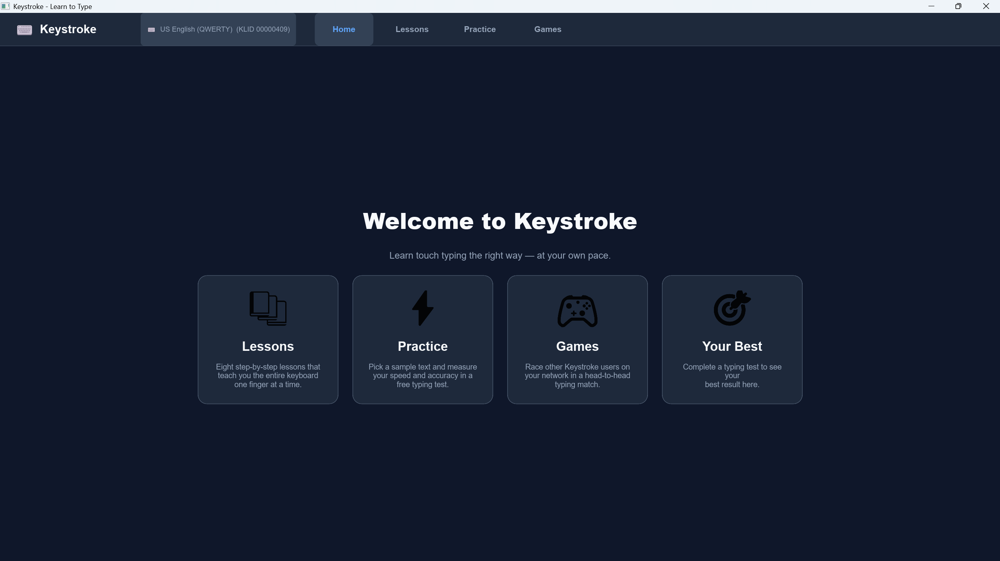
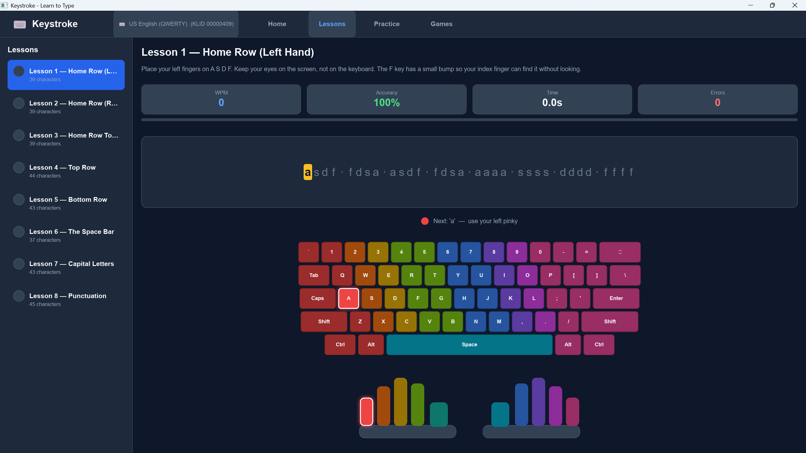
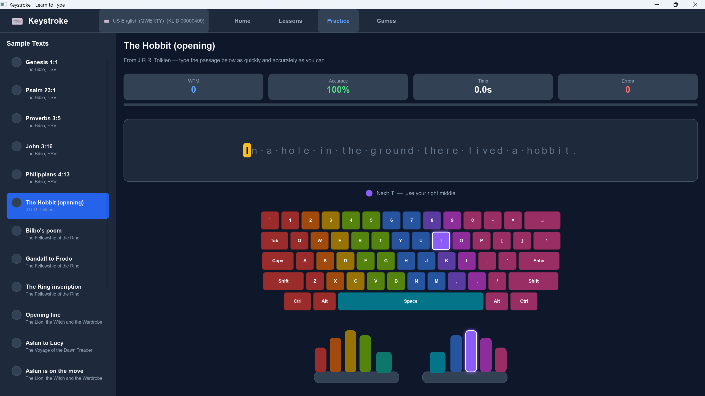
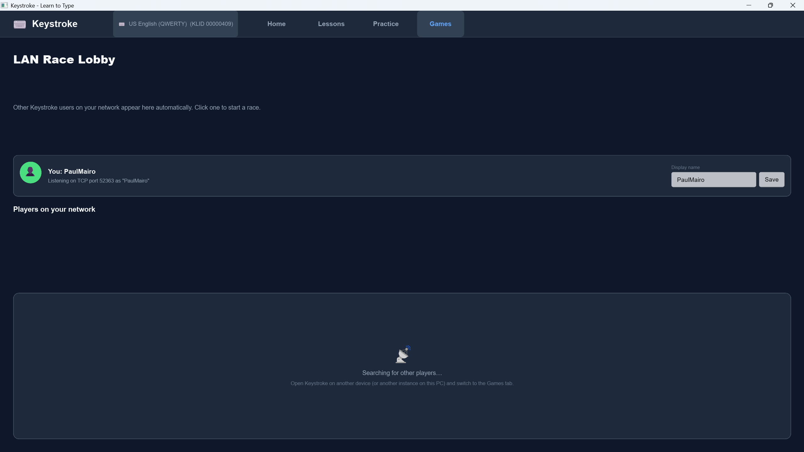

# Keystroke

> A typing tutor inspired by Typing Pal, built in Rust with the [Slint](https://slint.dev/) GUI toolkit.

## Overview

Keystroke is a desktop typing tutor that focuses on three things:

* **Learning** the keyboard one finger at a time through guided lessons.
* **Practicing** on real prose with live WPM and accuracy feedback.
* **Competing** against another player over the local network in a head-to-head typing race.

The app uses a visual on-screen keyboard with finger-color hints to teach correct fingering, and adapts to your physical keyboard layout (auto-detected on Windows).

## Features

### Sections

The app is organized into four pages, accessible from the top navigation bar:

* **Home** — landing page with quick links to each section and your most recent result.
* **Lessons** — eight progressive lessons that introduce the home row, top row, bottom row, space bar, capitals, and punctuation.
* **Practice** — pick a sample text and measure your speed and accuracy in a free typing test.
* **Games** — race another Keystroke instance on your LAN in a real-time typing match.

### Typing engine

* Live, character-by-character validation with colored feedback (correct / incorrect / pending).
* Automatic line wrapping that respects word boundaries.
* WPM (based on the standard 5-characters-per-word convention) and accuracy reported on completion.
* A randomized "Next" button in Practice to cycle through sample texts.

### Visual keyboard

* On-screen keyboard that highlights the next key to press.
* Per-finger color coding to teach correct hand position.
* Adapts to the active keyboard layout.

### Keyboard layouts

Built-in layouts (selectable; auto-detected from the active Windows layout when available):

* US English (QWERTY) — KLID `00000409`
* UK English (QWERTY) — KLID `00000809`
* French (AZERTY) — KLID `0000040C`
* German (QWERTZ) — KLID `00000407`
* Spanish (QWERTY) — KLID `0000040A`
* Norwegian (QWERTY) — KLID `00000414`

### Sample texts

The Practice mode ships with passages in English (Tolkien, C.S. Lewis, selected Bible verses) and Norwegian (Bjørnson's *Ja, vi elsker*, Ibsen's *Peer Gynt*, Hamsun's *Sult*, a Norwegian folk tale).

### LAN multiplayer race (Games)

* UDP broadcast discovery finds other Keystroke instances on the same local network — including multiple instances on the same machine.
* TCP-based race session with a synchronized countdown.
* Live opponent progress bar while you type.
* Result summary with winner/tie reporting.

## Screenshots

| Home | Lessons |
| --- | --- |
|  |  |

| Practice | Games |
| --- | --- |
|  |  |

## Technology

* **Language:** [Rust](https://www.rust-lang.org/) (Edition 2021)
* **GUI:** [Slint](https://slint.dev/) 1.8
* **Networking:** `socket2` for UDP/TCP socket configuration (enables multiple instances on one host to share the discovery port).
* **Windows integration:** `windows-sys` for active keyboard layout detection.

## Prerequisites

* **Rust toolchain** — install via [rustup](https://rustup.rs/).
* **Platform dependencies for Slint** — see the [Slint platform requirements](https://docs.slint.dev/latest/docs/slint/src/quickstart/) for your OS. Windows requires no extra packages; Linux typically needs Fontconfig and a working OpenGL / Vulkan stack.

## Getting started

```bash
git clone https://github.com/rmpr/keystroke.git
cd keystroke
cargo run --release
```

The first build downloads Slint and the other dependencies and may take a few minutes.

## Using the app

1. Launch with `cargo run` (or run the built binary).
2. From the **Home** page, choose Lessons, Practice, or Games.
3. In **Lessons** or **Practice**, just start typing — the timer begins on the first keystroke. Use the picker on the left to switch lesson or text.
4. In **Games**:
   * Set your display name.
   * Wait for other Keystroke instances on the LAN to appear in the lobby.
   * Click a peer to send a race invite. They'll see an accept/decline prompt.
   * After both sides accept, a countdown starts and the race begins.
   * The first player to finish the text correctly wins.

To try multiplayer locally, launch two instances of the app on the same machine — they will discover each other through the shared discovery port.

## Development

```bash
cargo build          # debug build
cargo test           # run unit tests (wrap-indices, etc.)
cargo run --release  # optimized run
```

The codebase is laid out as:

* `src/main.rs` — application state, Slint bindings, lesson/practice/game flow.
* `src/keyboard_layout.rs` — layout definitions and Windows layout detection.
* `src/texts.rs` — Practice-mode sample texts.
* `src/lessons.rs` — guided lesson content.
* `src/finger.rs` — finger-to-key mapping for the on-screen keyboard.
* `src/net.rs` — LAN discovery and race networking.
* `ui/appwindow.slint` — the entire UI.

## License

Released under the [MIT License](LICENSE).
